# CELO Cinema Dapp

## Table of Contents

-   [Description](#description)
-   [Site demo](#site-demo)
-   [Technologies](#technologies)
-   [Installation](#installation)
-   [Usage](#usage)
-   [License](#license)

# Description

This is a web application for cinema management that allow clients to book and buy tickets to different movie sessions. Web application has 3 pages - index(with list of movies), admin panel and user profile.Client has opportunity to see a list of available seats and already occupied ones by another users. The client can also purchase some tickets to different sessions at once.

There is admin panel on the site, owner and managers can access it and manipulate data. Admin panel has a managers page, where only owner can add and remove managers addresses to and from the list.

The information about films, sessions and tickets is saved on the blockchain and users cannot manipulate with contract without rights to do it.

# Site demo

DEMO LINK [CELO CINAME](link)

##NOTE
WALLET REQUIRED TO TEST THIS DAPP IS [CeloExtensionWallet](https://chrome.google.com/webstore/detail/celoextensionwallet/kkilomkmpmkbdnfelcpgckmpcaemjcdh)


# Technologies

* [Webpack](https://webpack.js.org)
* [Solidity](https://soliditylang.org)
* [HTML5](https://developer.mozilla.org/en-US/docs/Web/HTML)
* [JavaScript](https://developer.mozilla.org/en-US/docs/Web/JavaScript)
* [CSS](https://developer.mozilla.org/en-US/docs/Web/CSS)
* [Markdown](https://developer.mozilla.org/en-US/docs/MDN/Writing_guidelines/Howto/Markdown_in_MDN)
* [Bootstrap](https://getbootstrap.com/docs/4.0/getting-started/introduction)
* [jQuery](https://api.jquery.com)
* [ToastrJS](https://github.com/CodeSeven/toastr)
* [HystModal](https://addmorescripts.github.io/hystModal)
* [SpinJS](https://spin.js.org)
* [Font Awesome](https://fontawesome.com/v5/docs)
* [Flatpickr](https://flatpickr.js.org/getting-started)

# Installation

Open Terminal {Ctrl+Alt+T}

```sh
https://github.com/nadiarei/celo-cinema-dapp.git
```

```sh
cd celo-cinema-dapp
```
If you are using [VScode](https://code.visualstudio.com)
```sh
code .
```

This project uses [node](http://nodejs.org) and [npm](https://npmjs.com). Go check them out if you don't have them locally installed.

```sh
npm install
```

## Start a development server

```sh
npm run dev
```

## Build

```sh
npm run build
```
# Usage
1. Install the [CeloExtensionWallet](https://chrome.google.com/webstore/detail/celoextensionwallet/kkilomkmpmkbdnfelcpgckmpcaemjcdh) from the google chrome store.
2. Create or import a wallet.
3. Go to [https://celo.org/developers/faucet](https://celo.org/developers/faucet) and get tokens for the alfajores testnet.
4. Switch to the alfajores testnet in the CeloExtensionWallet.

# Site Overview


## Client side

When we open a site we will see a white screen and wallet authorization window.
[<p align="center">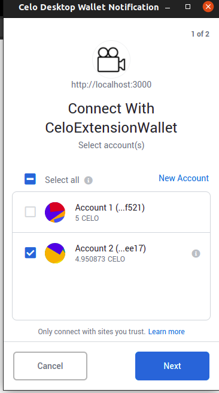</p>][def]

After successfull authorization we see an index page. On the menu there are "Admin panel" (only owner and managers can see this link) and "My profile" links.
On the content block there are blocks of movies(poster, title and "Watch sessions" button).
[<p align="center">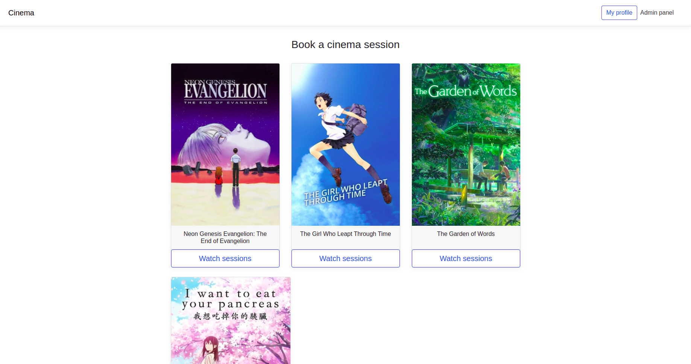</p>][def]

After clicking on the "Watch sessions" button we see a modal window with list of not expired session. Every session has specific date and time, amount of seats and price per one seat. Also, user can see occupied seats (they are invalid to select for the user).
[<p align="center">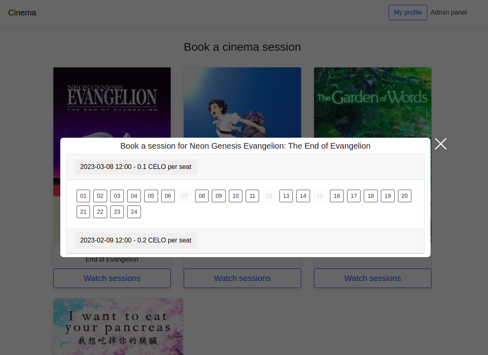</p>][def]

After selection of seats to purchase, we see a notification and an informational block about a puchase on the page.
[<p align="center">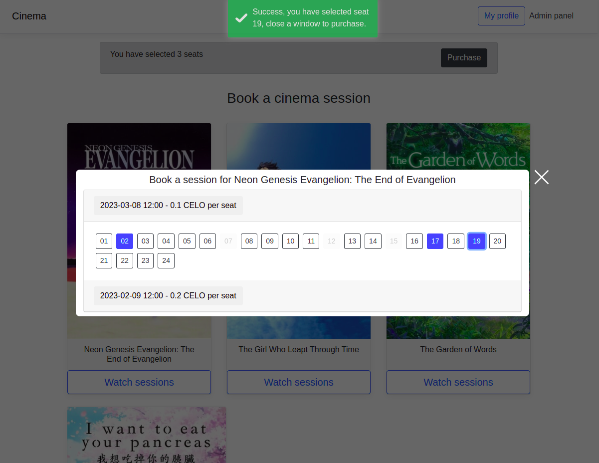</p>][def]

We can remove a ticket from cart if we click again on the seat button.
[<p align="center"></p>][def]

To purchase a tickets, we click on the "Purchase button" and see purchasing window with an information about added seats and total price. We can remove seats from here too.
[<p align="center">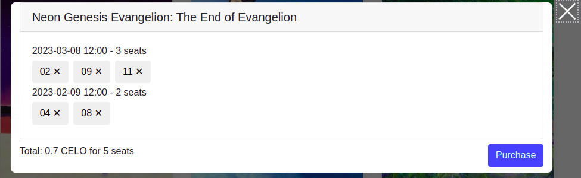</p>][def]

We need to pay a total price and gas fees to purchase tickets.
[<p align="center">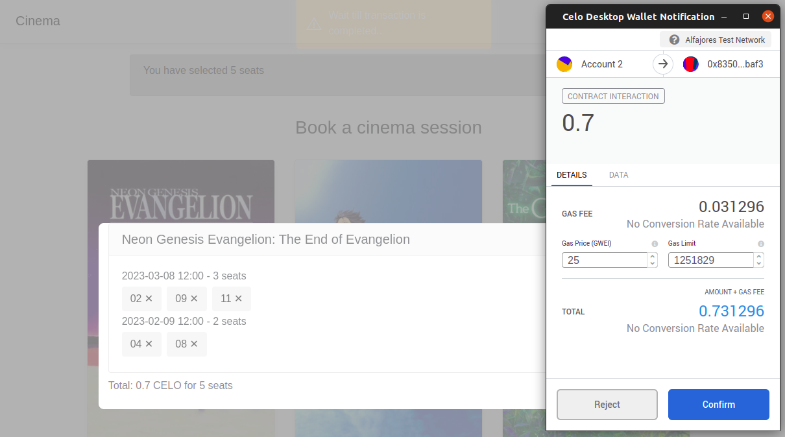</p>][def]

After successfull payment we can see our tickets with their status(used or not used) on the profile page.
[<p align="center">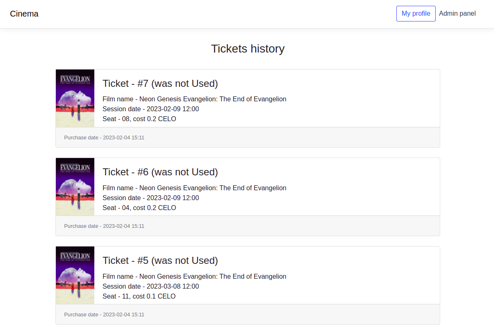</p>][def]

---

## Admin side

###NOTE. To manipulate with data we will need to pay gas fees, for example, to create/update/remove films or sessions.

On the admin panel as owner we see 3 toggles: Films, Purchased tickets and Managers. Only owner can watch/add/remove managers.
[<p align="center">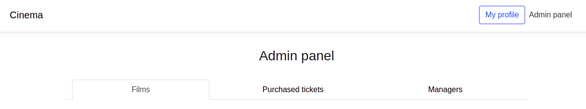</p>][def]

A view of a page as a manager.
[<p align="center">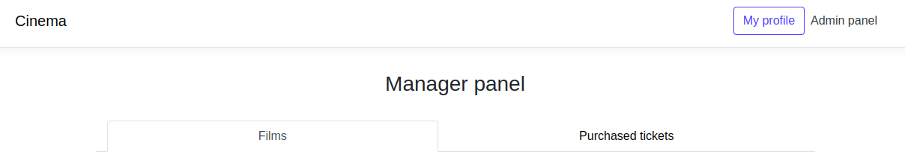</p>][def]

### Films toggle

On the films toggle we see a table with films (id, name of the film, link to the poster image, sessions and actions).
[<p align="center">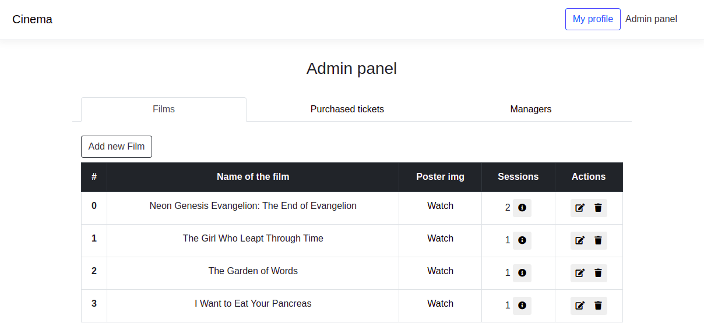</p>][def]

When we click on the information about session button, we see a modal window with table of sessions, where we can add session or change some of the already existing ones.
[<p align="center">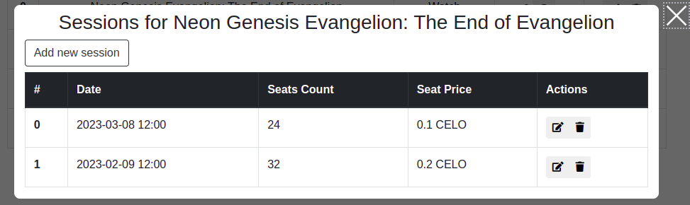</p>][def]

On the session creating/updating window we can choose a date and time, amount of seats and seat price in CELO.
[<p align="center">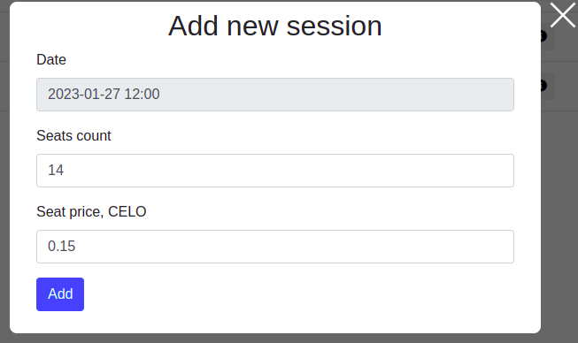 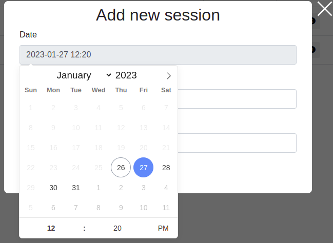</p>][def]

### Purchased tickets toggle

On this toggle we see a list of all clients and their purchased tickets, we can look at the information about the purchase and change a status of ticket(set it as used or not used)
[<p align="center">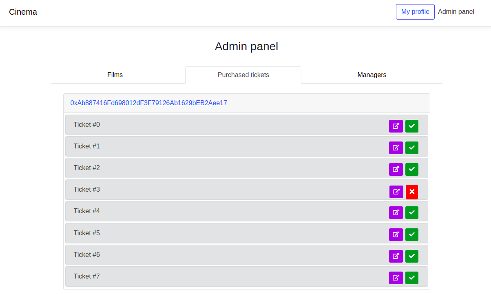</p>][def]

Information about ticket modal window.
[<p align="center">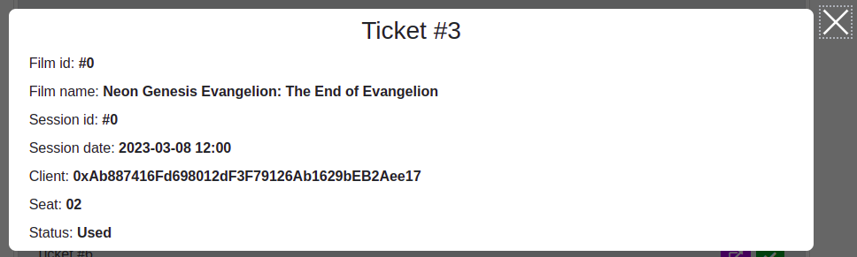</p>][def]

### Managers toggle

On this toggle we see a form that allows to add new manager and a list of added managers. We can remove a manager from list if we click on the trash button. Only owner can do actions with managers.
[<p align="center">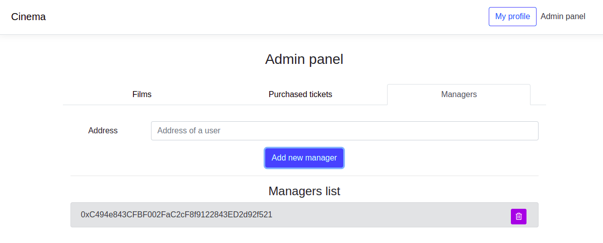</p>][def]

If we try to add already existing manager's address, we will get an error notification.
[<p align="center">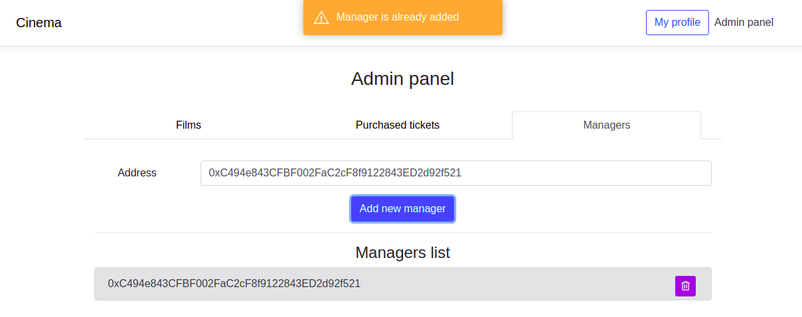</p>][def]

---

## License
> [MIT License](https://opensource.org/licenses/MIT) &copy; [LICENSE](LICENSE)

[def]: screenshots